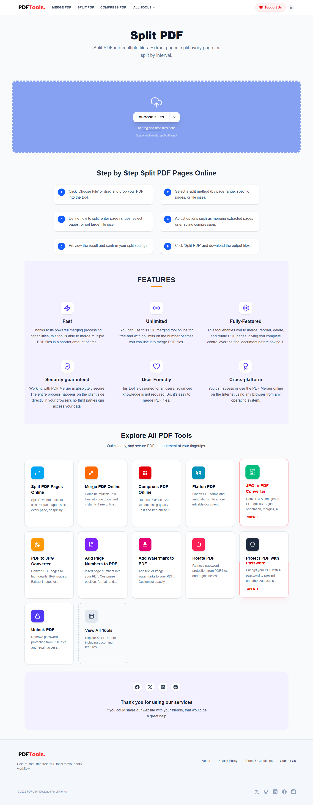
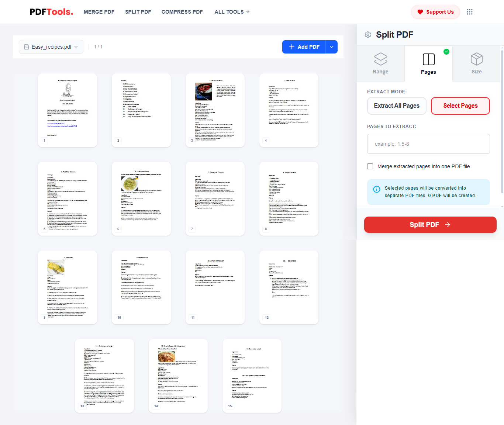
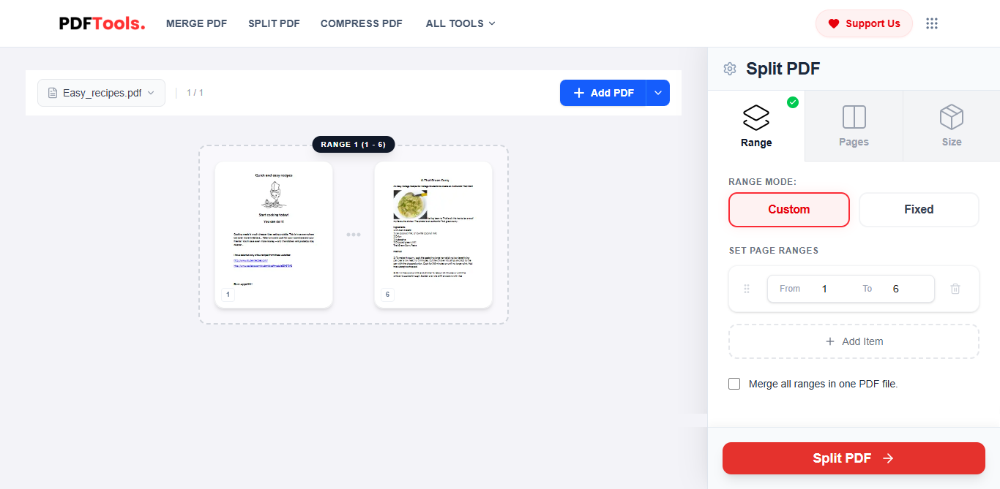
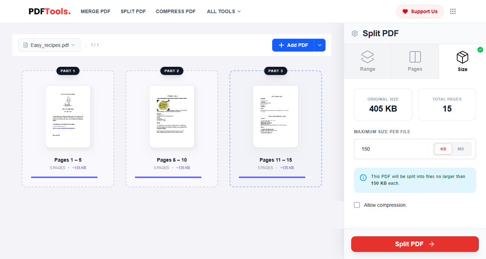

## PDF Splitter (TypeScript / Browser-Side)

A high-performance, lightweight utility for splitting PDF documents based on custom page ranges. This tool is designed to run entirely on the **client-side**, ensuring maximum privacy and zero server overhead.

---

### Features

* **Custom Page Ranges:** Supports complex input formats such as `1-3, 5, 8-10`.
* **Privacy-First:** All processing happens directly in the browser; files are never uploaded to a server.
* **Zero Dependencies:** Minimal footprint, relying only on the industry-standard `pdf-lib`.
* **TypeScript Ready:** Fully typed for a seamless developer experience.
* **Universal Compatibility:** Works in modern browsers and Node.js environments.

---

### Installation

```bash
npm install pdf-lib
```

---

### Usage

```typescript
import { splitPdf } from "./pdf-splitter";

// Load your PDF as an ArrayBuffer
const file = await fetch("/sample.pdf").then(res => res.arrayBuffer());

// Define your desired ranges
const result = await splitPdf(file, "1-3,5");

// Output is a Uint8Array containing the new PDF
// You can then trigger a download or display it in the browser
```

---

### Page Input Format

The parser is flexible and handles various range configurations:

| Input | Resulting Pages |
| :--- | :--- |
| `1` | Page 1 |
| `1,2,3` | Pages 1, 2, and 3 |
| `1-5` | Pages 1 through 5 |
| `5-1` | Auto-corrected to 1-5 |
| `1,3-5,8` | Mixed individual pages and ranges |

---

### Demo

The screenshot below illustrates a complete web application built using this core logic. 

### 1. Upload your PDF


### 2. Choose split method (Pages / Range / Size)


### 3. Configure ranges visually


### 4. Export split files instantly


> **Note:** This repository contains the **core logic only**. The UI and additional tools are available in the full version.


---

### Full Projects

Looking for a production-ready SaaS solution? The full platform includes:

* **Modern UI:** Drag & drop interface built with React/Tailwind.
* **50+ PDF Tools:** Merge, Compress, Convert, Protect, and more.
* **Batch Processing:** Handle multiple files simultaneously.
* **Optimized Performance:** GTmetrix A-grade performance with multi-language support.

👉 [**Get the Full Source Code**](https://nocodeteam.gumroad.com/l/pdftools)

---

### License

This project is licensed under the **MIT License**.

It utilizes `pdf-lib` (MIT License) - [github.com/Hopding/pdf-lib](https://github.com/Hopding/pdf-lib).

---

### Attribution & Safety

* **Clean Implementation:** No proprietary code; built using standard open-source libraries.
* **Standalone Value:** Provides a fully functional utility for developers to integrate immediately.
* **Verified Logic:** This implementation was created with the assistance of AI tools and manually reviewed for production standards.
